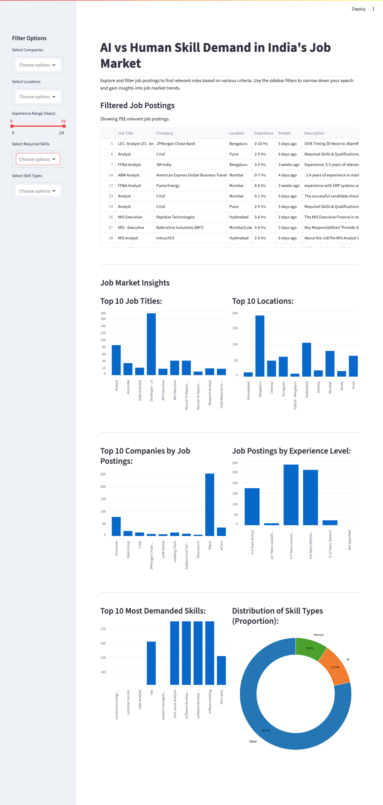

# 🧠 AI vs Human Skill Demand – Job Market Analyzer

This Streamlit web app analyzes job listings for Data Analyst roles in India. It highlights the rising gap between AI-automatable and human-centric skills by classifying and visualizing real job postings scraped from Naukri.com.

---

## 📌 Project Objectives

- Scrape real-time job data from Naukri.com
- Classify skills as AI-based, Human-centric, or Other
- Visualize trends in job titles, skills, locations, and experience
- Empower job seekers with insights on future-proof skillsets

---

## 🕸️ Web Scraping: Naukri.com

### ✅ Scraping Goals

- Collect job postings for `"Data Analyst"` roles in India
- Extract:
  - Job Title
  - Company Name
  - Location
  - Experience Required
  - Date Posted
  - Job Description
  - Listed Skills

### 🔧 Tools Used

- `Selenium` – For dynamic content scraping
- `ChromeDriver` – Automated browser control
- `BeautifulSoup` – HTML parsing (optional)
- `time.sleep()` with random delays to mimic human browsing

> ⚠️ **Ethical Use**: Scraping was done responsibly for educational and analytical purposes. This project follows good scraping practices—rate-limiting, avoiding excessive requests, and not violating site terms.

---

## 🚀 Features

- Dynamic filters: Company, Location, Experience, Skill Type, Job Title, and Posting Time
- Clean dashboard layout with custom styling
- Charts showing:
  - Top Job Titles
  - Top Hiring Locations
  - Most Common Skills
  - Skill Type Distribution
- AI skill vs Human skill visual comparison

---

## 🛠 Tech Stack

- **Frontend**: Streamlit
- **Backend**: Python 3
- **Data Handling**: Pandas
- **Visualization**: Streamlit charts
- **Scraping**: Selenium + ChromeDriver + (optional BeautifulSoup)

---

---

## 🖼️ Screenshot



---

## ⚙️ Setup & Run Locally

### 1. Clone the repo

```bash
git clone https://github.com/yourusername/ai_job_trends_india_2025.git
cd ai_job_trends_india_2025
```

### 🔧 Create & Activate Virtual Environment

```bash
# Create virtual environment
python3 -m venv venv
```
# Activate (macOS / Linux)
source venv/bin/activate
pip install -r requirements.txt

## 📊 Dataset Summary

`naukri_skill_tagged_data.csv` contains:

- `Job Title`, `Company`, `Location`, `Experience`, `Posted`
- `Description`, `Skills`, `Skill_List`, `Skill_Type_List`
- `Min_Experience`, `Max_Experience`

---

## 📄 License

MIT License – Free to use, modify, and distribute with credit.

---

## 🙋‍♀️ Author

**Priyanka Malavade**  
_Data Analyst in progress, focused on data storytelling & real-world insights_  


